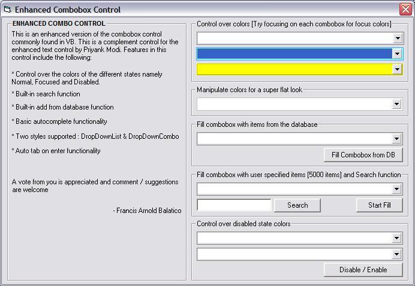



## Enhanced Combobox Control

### Description

This is an enhancment version of the combobox found in visual basic. A complimentary control to Priyank Modi's Enhanced Text Control. Built-in features and added GUI control are the highlights of this control. Hope you like it.

I will appreciate it if you could vote for it and I will appreciate it more if you could give comments / suggestions on it.

For more details and instructions just read the included ReadMe text file.
 
### More Info
 

             |
---                |---
**Submitted On**   |2006-10-25 08:56:18
**By**             |[Francis Arnold G\. Balatico](https://github.com/Planet-Source-Code/PSCIndex/blob/master/ByAuthor/francis-arnold-g-balatico.md)
**Level**          |Intermediate
**User Rating**    |4.7 (14 globes from 3 users)
**Compatibility**  |VB 6\.0
**Category**       |[Custom Controls/ Forms/  Menus](https://github.com/Planet-Source-Code/PSCIndex/blob/master/ByCategory/custom-controls-forms-menus__1-4.md)
**World**          |[Visual Basic](https://github.com/Planet-Source-Code/PSCIndex/blob/master/ByWorld/visual-basic.md)
**Archive File**   |[Enhanced\_C2028331112006\.zip](https://github.com/Planet-Source-Code/francis-arnold-g-balatico-enhanced-combobox-control__1-66962/archive/master.zip)

